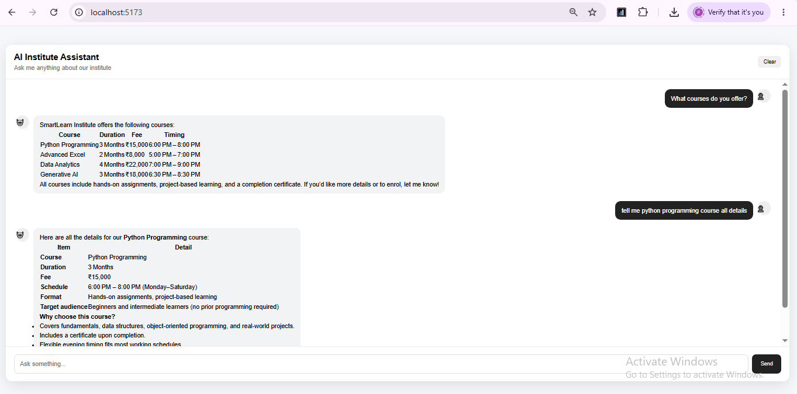

# 🤖 AI Institute Assistant 

A practical AI Institute Assistant built with Python, FastAPI, React, RAG, ChromaDB, Groq, and tool calling.

Version 4 introduces a single tool-using AI agent that can decide which tool to use, execute it, observe the result, and continue until it can answer the user's question.

---

### 🚀 Features

- 💬 React chat interface
- ⚡ FastAPI backend
- 🧠 Groq LLM
- 📚 RAG over institute PDF documents
- 🗄️ ChromaDB vector database
- 🔎 Sentence-transformer embeddings
- 🛠️ Tool calling
- 🎓 Course information tool
- 💰 Fee calculation tool
- 📖 Knowledge-search tool
- 🔄 Iterative agent loop with a safety limit
- 📝 Markdown rendering
- 📊 GitHub-style table rendering
- 🌐 CORS support for local React development
- 🔐 Environment variable support for API keys

---

### 🏗️ Architecture

React Frontend
      |
      | POST /chat
      v
FastAPI Backend
      |
      v
AI Agent Loop
      |
      +---- search_knowledge() ----> ChromaDB ----> Institute PDFs
      |
      +---- get_course_info()
      |
      +---- calculate_fee()
      |
      v
Groq LLM
      |
      v
Final Answer

---

### 🛠️ Tech Stack

Frontend

- React
- JavaScript
- Vite
- React Markdown
- CSS

Backend

- Python
- FastAPI
- Uvicorn

AI

- Groq API
- Large Language Model
- Tool Calling
- AI Agent Loop

RAG

- ChromaDB
- Sentence Transformers
- PyPDF
- LangChain Community

---

### 📁 Project Structure

AI-Institute-Assistant-Version-4/
│
├── README.md
│
├── backend/
│   ├── main.py
│   ├── rag.py
│   ├── tools.py
│   ├── upload_docs.py
│   ├── requirements.txt
│   ├── .env.example
│   │
│   ├── data/
│   │   └── README.txt
│   │
│   └── vector_db/
│       └── (created automatically)
│
└── frontend/
    ├── package.json
    ├── index.html
    │
    └── src/
        ├── App.jsx
        ├── App.css
        ├── index.css
        └── main.jsx

---

### ⚙️ Setup

1. Prerequisites

Install:

- Python 3.10+
- Node.js 18+
- npm
- Groq API key

Important: Keep the API key only in the backend. Never put it in React/frontend code.

---

2. Backend Setup

Open a terminal:

cd backend

Create a virtual environment:

python -m venv venv

Windows

venv\Scripts\activate

macOS/Linux

source venv/bin/activate

Install dependencies:

pip install -r requirements.txt

Create ".env" from ".env.example":

GROQ_API_KEY=your_groq_api_key_here

---

📚 3. Add Institute Documents

Place your institute PDF documents inside:

backend/data/

For example:

backend/data/courses.pdf
backend/data/fees.pdf
backend/data/timings.pdf

Then create the vector database:

python upload_docs.py

This process:

1. Reads the PDFs
2. Extracts the text
3. Splits the text into chunks
4. Creates embeddings
5. Stores the embeddings in ChromaDB

The "vector_db/" directory is created automatically.

---

🚀 4. Start FastAPI

From the "backend" directory:
```bash
uvicorn main:app --reload
```
The API will run at:
```bash
http://localhost:8000
```
---

💻 5. Start the Frontend

Open another terminal:
```bash
cd frontend
```
Install dependencies:
```bash
npm install
```
Start the development server:
```bash
npm run dev
```
Open the URL shown by Vite, normally:
```bash
http://localhost:5173
```
---

### 💬 Example Questions

Try questions such as:

What courses do you offer?

How much does Python cost?

What is the fee for Python and Advanced Excel together?

What are the class timings?

What is your refund policy?

How can I contact the institute?

---

### 🛠️ AI Agent Tools

The agent can choose between three tools.

1. "search_knowledge()"

Searches institute documents using RAG and ChromaDB.

Example:

What is your refund policy?

---

2. "get_course_info()"

Retrieves information about available courses.

Example:

What courses do you offer?

Tell me about the Python course.

---

3. "calculate_fee()"

Calculates the total fee for selected courses.

Example:

What is the total fee for Python and Advanced Excel?

The agent can retrieve the required course fees and then use the fee-calculation tool.

---

### 🤖 How the AI Agent Works

The key feature of Version 4 is the iterative agent loop.

User Question
      ↓
LLM Understands Request
      ↓
Does it need a tool?
      ↓
     Yes
      ↓
Call Tool
      ↓
Tool Result Returned to LLM
      ↓
Does it need another tool?
      ↓
     Yes
      ↓
Call Another Tool
      ↓
     No
      ↓
Final Answer

The backend limits the number of agent steps to prevent an endless tool-calling cycle.

---

### 🔄 Example Agent Flow

For the question:

What is the total fee for Python and Advanced Excel?

The agent can perform:

User Question
      ↓
Understand the request
      ↓
get_course_info()
      ↓
Retrieve Python fee
      ↓
get_course_info()
      ↓
Retrieve Advanced Excel fee
      ↓
calculate_fee()
      ↓
Final Answer

This demonstrates how an AI agent can use multiple tools in sequence before generating the final response.

---

### 📊 Technologies

Technology| Purpose
Python| Backend and AI logic
FastAPI| REST API
React| Frontend
Vite| Frontend development server
Groq| LLM inference
ChromaDB| Vector database
Sentence Transformers| Text embeddings
LangChain Community| PDF/vector integrations
PyPDF| PDF loading
React Markdown| Markdown rendering

---

### 🔐 Security

Do not commit your real API key.

Never upload:

backend/.env

Use:

backend/.env.example

with:

GROQ_API_KEY=your_groq_api_key_here

Recommended ".gitignore":

.env
venv/
__pycache__/
*.pyc
node_modules/
dist/
backend/vector_db/

---


### 🎯 Learning Value

Version 4 demonstrates how to build a practical tool-using AI agent.

The project covers:

- LLM integration
- RAG
- Vector databases
- Embeddings
- Tool calling
- Agent loops
- Multiple tool execution
- FastAPI backend development
- React frontend development
- Environment-based configuration

---

🔮 Future Improvements

Possible future extensions include:

- 🔐 User authentication
- 🗄️ PostgreSQL database
- 🧠 Persistent memory
- 📊 Admin dashboard
- 👨‍🎓 Student management
- 💰 Fee tracking
- 📋 Attendance tracking
- 📞 Lead management
- 🔔 Automated follow-ups
- 📈 Institute analytics
- ☁️ Cloud deployment
- 🔍 Observability and logging
- 🤖 Multi-agent architecture

---

📸 Screenshot

---

### 📌 Project Status

Single AI Agent with Tool Calling

A learning and portfolio project demonstrating how a chatbot can use RAG, tools, and an iterative agent loop to answer institute-related questions.